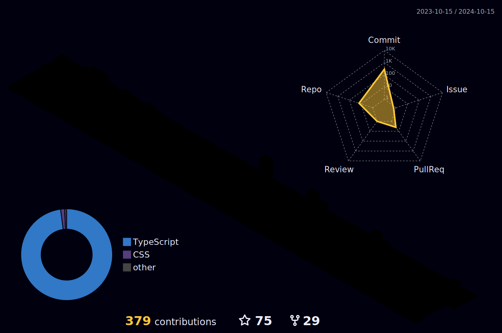

  
  

 |  |  |  
 | ----------- | ----------- |

 
  

   

  

 
##
   

       
  

### About Me

- 📚 I'm currently learning AWS, Docker and Java.
- 🎯 Goals: become a software developer 👩‍💻 and be free 💲
- 🧨 Never give up
 

 
  
  

  

